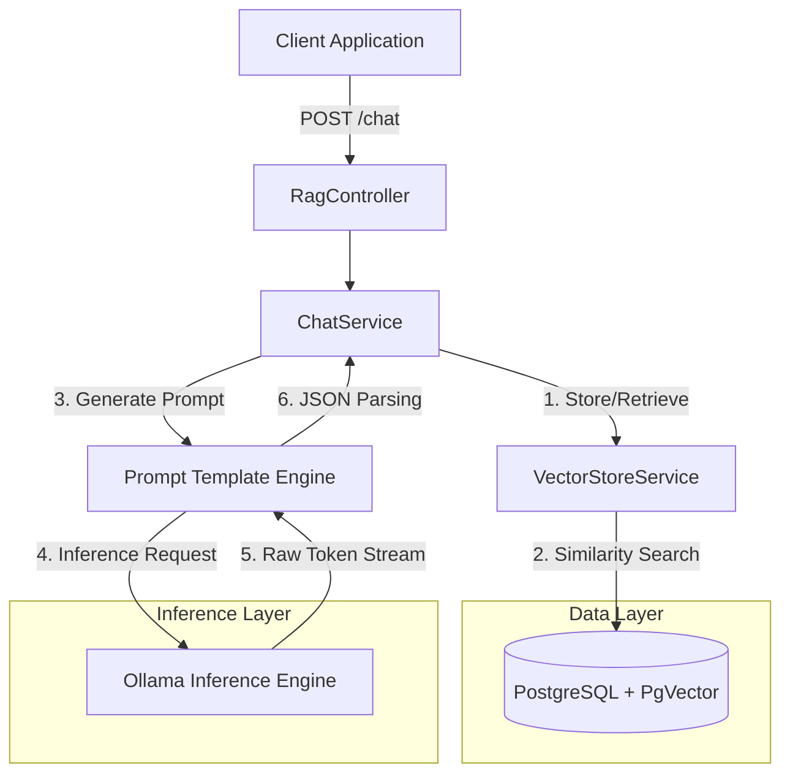

# RAG Shopping Assistant Module: Technical Documentation

## 1. Introduction

The Retrieval-Augmented Generation (RAG) Shopping Assistant is a specialized module designed to provide context-aware, deterministic product recommendations. By integrating Vector Space Modeling (VSM) with Large Language Models (LLMs), the system bridges the gap between unstructured natural language queries and structured inventory data.

This document serves as the authoritative technical reference for the architecture, implementation, and extension of the RAG module.

### 1.1 Key Capabilities

*   **Semantic Information Retrieval:** Utilizes vector embeddings (768-dimensional) to identify product relevance beyond keyword matching.
*   **Deterministic Structured Output:** Enforces strict JSON schemas for responses, enabling robust frontend integration (Generative UI).
*   **Hallucination Mitigation:** Implements strict context boundaries to ensure recommendations are derived exclusively from available inventory.
*   **Prompt Engineering:** Leverages chain-of-thought prompting and XML-structured context to guide LLM reasoning.

---

## 2. System Architecture

The system follows a micro-service oriented architecture pattern, orchestrating interactions between the application layer, vector database, and inference engine.

### 2.1 Information Flow Pipeline

The RAG pipeline executes the following sequence for each user interaction:

1.  **Query Decomposition:** The user's natural language input is received.
2.  **Vector Embedding:** The input is converted into a vector representation using the `nomic-embed-text` model.
3.  **Semantic Retrieval:** A Cosine Similarity search is performed against the `vector_store` in PostgreSQL to retrieve the top $K$ relevant product documents.
4.  **Context Construction:** Retrieved products are formatted into a structured `INVENTORY` context block.
5.  **Prompt Synthesis:** A dynamic system prompt is constructed, combining the `INVENTORY` context, user query, and output schema instructions.
6.  **Inference & Parsing:** The `llama3.2` model generates a response, which is then parsed by the `BeanOutputConverter` into a strongly-typed `ShopAssistantResponse` object.

### 2.2 Component Diagram



---

## 3. Data Specification

### 3.1 Response Schema (`ShopAssistantResponse`)

The API guarantees a structured response adhering to the following schema. This strict typing facilitates direct mapping to UI components.

| Field | Type | Description |
| :--- | :--- | :--- |
| `summary` | `String` | A concise, natural language synopsis of the recommendation (1-2 sentences). |
| `detailedResponse` | `String` (Markdown) | A comprehensive elaboration including "Hero" recommendations, alternatives, and sensory descriptions. |
| `products` | `List<ProductRecommendation>` | A structured list of distinct products referenced in the response. |
| `nextSteps` | `List<String>` | Three distinct follow-up actions or inquiries to guide user engagement. |

### 3.2 Product Entity (`ProductRecommendation`)

| Field | Type | Constraint | Description |
| :--- | :--- | :--- | :--- |
| `id` | `UUID` | **Immutable** | The unique identifier of the product as indexed in the database. |
| `name` | `String` | **Immutable** | The exact display name of the product. |
| `price` | `BigDecimal` | `> 0` | The current retail price. |
| `reasonForRecommendation` | `String` | | A generated justification explaining semantic relevance to the query. |

---

## 4. Implementation Details

### 4.1 Vector Store Configuration

The system utilizes `pgvector` for high-performance vector operations within PostgreSQL.

*   **Metric:** Cosine Similarity
*   **Dimensions:** 768
*   **Index Type:** HNSW (Hierarchical Navigable Small World) for efficient approximate nearest neighbor search.

### 4.2 Prompt Engineering Strategy

Prompts are managed as external resources in `src/main/resources/prompt/` to allow for iteration without code recompilation.

*   **Context Isolation:** Inventory data is encapsulated within clear delimiters (e.g., `INVENTORY:`) to preventing data leakage.
*   **Instruction Tuning:** "Chain of thought" logic is embedded in the system prompt to guide the model through filtering, selection, and formatting steps.
*   **Schema Enforcement:** The `BeanOutputConverter` injects a JSON schema definition directly into the prompt to constrain the output format.

---

## 5. Deployment & Configuration

### 5.1 Environmental Requirements

The implementation relies on the following variable definitions (`.env`):

```bash
# Inference Engine Configuration
OLLAMA_BASE_URL=http://ollama:11434
OLLAMA_CHAT_MODEL=llama3.2
OLLAMA_EMBEDDING_MODEL=nomic-embed-text

# RAG Hyperparameters
RAG_SEARCH_TOP_K=5              # Cardinality of retrieval set
RAG_SIMILARITY_THRESHOLD=0.3    # Minimum relevance score (0.0 - 1.0)
```

### 5.2 Infrastructure Setup

The orchestration is defined via `docker-compose.yml`. Ensure the `ollama` service is healthy before application startup.

```bash
# Model Initialization (One-time setup)
./scripts/setup-ollama.sh
```

---

## 6. Operational Procedures

### 6.1 Indexing Strategy

Indexing is an asynchronous, administrative operation. It involves iterating through the product catalog, generating embeddings, and upserting into the vector store.

**Endpoint:** `POST /per/rag/index`
**Authentication:** Requires `ADMIN` role.

### 6.2 Maintenance & Troubleshooting

**Common Anomaly: Zero-Result Queries**
*   *Diagnosis:* High `RAG_SIMILARITY_THRESHOLD` or empty vector store.
*   *Resolution:* Verify index status via `GET /per/rag/knowledge/status` and adjust threshold in `application.yml`.

**Common Anomaly: Malformed JSON Output**
*   *Diagnosis:* The LLM may encase raw JSON in Markdown code blocks (` ```json `).
*   *Resolution:* The `cleanMarkdownCodeBlocks()` middleware automatically sanitizes the output string before parsing.

---

## 7. Extensibility Guidelines

To extend the module's capabilities:

1.  **New Data Sources:** Implement `DocumentReader` interfaces to ingest non-product data (e.g., blog posts, policies).
2.  **Custom Models:** Implement `ChatModel` interface to swap Ollama for OpenAI or Azure equivalents.
3.  **Prompt Iteration:** Modify `system-prompt.txt` to adjust tone, restrictions, or formatting rules. Changes take effect on next request (runtime loading).
