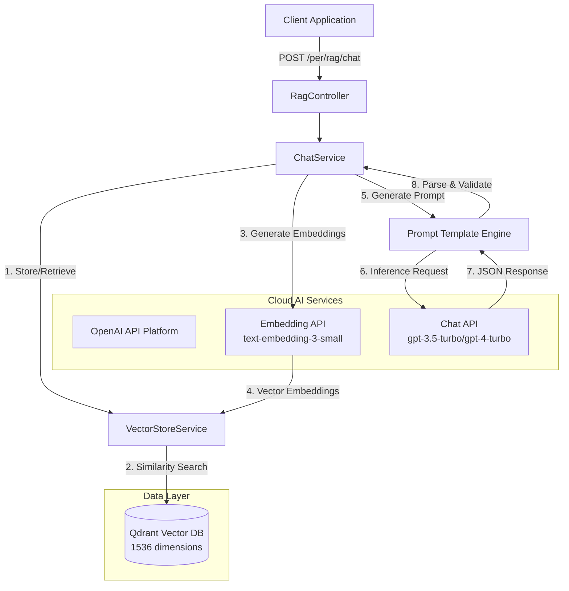

# RAG Shopping Assistant Module: Technical Documentation

## 1. Introduction

The Retrieval-Augmented Generation (RAG) Shopping Assistant is a specialized module designed to provide context-aware, deterministic product recommendations. By integrating Vector Space Modeling (VSM) with Large Language Models (LLMs) via OpenAI's cloud-based inference platform, the system bridges the gap between unstructured natural language queries and structured inventory data.

This document serves as the authoritative technical reference for the architecture, implementation, and extension of the RAG module.

### 1.1 Key Capabilities

*   **Semantic Information Retrieval:** Utilizes vector embeddings (1536-dimensional) generated by OpenAI's `text-embedding-3-small` model to identify product relevance beyond keyword matching.
*   **Deterministic Structured Output:** Enforces strict JSON schemas for responses, enabling robust frontend integration (Generative UI).
*   **Hallucination Mitigation:** Implements strict context boundaries to ensure recommendations are derived exclusively from available inventory.
*   **Prompt Engineering:** Leverages chain-of-thought prompting and XML-structured context to guide LLM reasoning.
*   **Automated Initialization:** Automatically detects empty vector stores and triggers indexing on application startup.

---

## 2. System Architecture

The system follows a cloud-native architecture pattern, orchestrating interactions between the application layer, vector database (Qdrant), and OpenAI's inference platform.

### 2.1 Information Flow Pipeline

The RAG pipeline executes the following sequence for each user interaction:

1.  **Query Decomposition:** The user's natural language input is received via REST API.
2.  **Vector Embedding:** The input is converted into a 1536-dimensional vector representation using OpenAI's `text-embedding-3-small` embedding model.
3.  **Semantic Retrieval:** A Cosine Similarity search is performed against the `vector_store` table in PostgreSQL to retrieve the top $K$ relevant product documents.
4.  **Context Construction:** Retrieved products are formatted into a structured `INVENTORY` context block with metadata.
5.  **Prompt Synthesis:** A dynamic system prompt is constructed, combining the `INVENTORY` context, user query, and output schema instructions.
6.  **Inference & Parsing:** OpenAI's chat model (default: `gpt-3.5-turbo`) generates a response, which is then parsed by the `BeanOutputConverter` into a strongly-typed `ShopAssistantResponse` object.

### 2.2 Component Diagram



---

## 3. Data Specification

### 3.1 Response Schema (`ShopAssistantResponse`)

The API guarantees a structured response adhering to the following schema. This strict typing facilitates direct mapping to UI components.

| Field | Type | Description |
| :--- | :--- | :--- |
| `summary` | `String` | A concise, natural language synopsis of the recommendation (1-2 sentences). |
| `detailedResponse` | `String` (Markdown) | A comprehensive elaboration including "Hero" recommendations, alternatives, and sensory descriptions. |
| `products` | `List<ProductRecommendation>` | A structured list of distinct products referenced in the response. |
| `nextSteps` | `List<String>` | Three distinct follow-up actions or inquiries to guide user engagement. |

### 3.2 Product Entity (`ProductRecommendation`)

| Field | Type | Constraint | Description |
| :--- | :--- | :--- | :--- |
| `id` | `UUID` | **Immutable** | The unique identifier of the product as indexed in the database. |
| `name` | `String` | **Immutable** | The exact display name of the product. |
| `price` | `BigDecimal` | `> 0` | The current retail price. |
| `reasonForRecommendation` | `String` | | A generated justification explaining semantic relevance to the query. |

---

## 4. Implementation Details

### 4.1 Vector Store Configuration

The system utilizes Qdrant as the vector database for high-performance vector operations.

*   **Metric:** Cosine Similarity
*   **Dimensions:** 1536 (aligned with OpenAI's `text-embedding-3-small` model output)
*   **Index Type:** HNSW (Hierarchical Navigable Small World) for efficient approximate nearest neighbor search.
*   **Collection Name:** `product_vectors`
*   **API:** REST/gRPC via Spring AI Qdrant Store Starter

### 4.2 Prompt Engineering Strategy

Prompts are managed as external resources in `src/main/resources/prompt/` to allow for iteration without code recompilation.

*   **Context Isolation:** Inventory data is encapsulated within clear delimiters (e.g., `INVENTORY:`) to prevent data leakage.
*   **Instruction Tuning:** "Chain of thought" logic is embedded in the system prompt to guide the model through filtering, selection, and formatting steps.
*   **Schema Enforcement:** The `BeanOutputConverter` injects a JSON schema definition directly into the prompt to constrain the output format.

### 4.3 Automated Initialization

The `RagDataInitializer` component (implementing `CommandLineRunner`) automatically verifies vector store state on application startup:

*   **Verification:** Performs lightweight query to check document count
*   **Conditional Indexing:** If vector store is empty (`totalDocuments == 0`), automatically triggers:
    *   Product catalog indexing
    *   Knowledge base document indexing
*   **Asynchronous Execution:** Runs in background thread to avoid blocking application startup
*   **Configuration:** Controlled via `app.rag.auto-index` property (default: `true`)

---

## 5. Deployment & Configuration

### 5.1 Environmental Requirements

The implementation relies on the following variable definitions (`.env`):

```bash
# OpenAI API Configuration
OPENAI_API_KEY=sk-proj-...                    # Required: OpenAI API key
OPENAI_CHAT_MODEL=gpt-3.5-turbo               # Optional: Default chat model
OPENAI_EMBEDDING_MODEL=text-embedding-3-small # Optional: Default embedding model

# RAG Hyperparameters
RAG_SEARCH_TOP_K=5              # Cardinality of retrieval set
RAG_SIMILARITY_THRESHOLD=0.3    # Minimum relevance score (0.0 - 1.0)

# Auto-Indexing Control
APP_RAG_AUTO_INDEX=true         # Enable automatic indexing on startup
```

### 5.2 Infrastructure Setup

The orchestration is defined via `docker-compose.yml`. No local inference engine is required—all AI operations are handled by OpenAI's cloud platform.

**Prerequisites:**
1. Valid OpenAI API key with access to:
   * Chat models (e.g., `gpt-3.5-turbo`, `gpt-4-turbo`)
   * Embedding models (`text-embedding-3-small`)
2. Qdrant instance (self-hosted via Docker or cloud)
3. Network connectivity to `api.openai.com`

**Infrastructure:**
Qdrant is deployed via `docker-compose.yml` with persistent storage in `./qdrant_storage`.

### 5.3 Application Configuration

**`application.yml`** (or profile-specific variants):

```yaml
spring:
  ai:
    openai:
      api-key: ${OPENAI_API_KEY}
      chat:
        model: ${OPENAI_CHAT_MODEL:gpt-3.5-turbo}
      embedding:
        model: ${OPENAI_EMBEDDING_MODEL:text-embedding-3-small}
    vectorstore:
      qdrant:
        host: ${QDRANT_HOST:qdrant}
        port: ${QDRANT_PORT:6334}
        collection-name: ${QDRANT_COLLECTION:product_vectors}
        use-tls: false

app:
  rag:
    auto-index: ${APP_RAG_AUTO_INDEX:true}
    chat-model: ${OPENAI_CHAT_MODEL:gpt-3.5-turbo}
    search-top-k: ${RAG_SEARCH_TOP_K:3}
    similarity-threshold: ${RAG_SIMILARITY_THRESHOLD:0.3}
```

---

## 6. Operational Procedures

### 6.1 Indexing Strategy

**Automatic Indexing (Recommended):**
Indexing occurs automatically on application startup if the vector store is empty. The `RagDataInitializer` component handles this process asynchronously.

**Manual Indexing:**
For administrative re-indexing or updates:

**Endpoint:** `POST /per/rag/index`
**Authentication:** Requires `ADMIN` role.
**Description:** Triggers full product catalog re-indexing.

**Knowledge Base Indexing:**
**Endpoint:** `POST /per/rag/knowledge/index`
**Authentication:** Requires `ADMIN` role.
**Description:** Indexes all markdown files from the knowledge base directory.

### 6.2 Status Monitoring

**Endpoint:** `GET /per/rag/knowledge/status`
**Authentication:** Public (no authentication required)
**Response:**
```json
{
  "totalDocuments": 150,
  "productDocuments": 120,
  "knowledgeDocuments": 30,
  "knowledgeSources": ["policies.md", "faq.md"],
  "isIndexed": true
}
```

### 6.3 Maintenance & Troubleshooting

**Common Anomaly: Zero-Result Queries**
*   *Diagnosis:* High `RAG_SIMILARITY_THRESHOLD` or empty vector store.
*   *Resolution:* 
    1. Verify index status via `GET /per/rag/knowledge/status`
    2. Adjust threshold in `application.yml` (reduce `RAG_SIMILARITY_THRESHOLD`)
    3. If store is empty, trigger manual indexing or restart application (auto-index will run)

**Common Anomaly: Malformed JSON Output**
*   *Diagnosis:* The LLM may encase raw JSON in Markdown code blocks (` ```json `).
*   *Resolution:* The `cleanMarkdownCodeBlocks()` middleware automatically sanitizes the output string before parsing.

**Common Anomaly: OpenAI API Errors**
*   *Diagnosis:* Invalid API key, rate limiting, or model unavailability.
*   *Resolution:*
    1. Verify `OPENAI_API_KEY` is set correctly
    2. Check API key has access to specified models
    3. Review OpenAI API status and rate limits
    4. Consider upgrading to a model tier with higher rate limits

**Common Anomaly: Vector Dimension Mismatch**
*   *Diagnosis:* Database schema uses incorrect vector dimensions (e.g., 768 instead of 1536).
*   *Resolution:* Ensure Flyway migration `V18__Enable_pgvector_extension.sql` has been applied with 1536 dimensions.

---

## 7. Extensibility Guidelines

To extend the module's capabilities:

1.  **New Data Sources:** Implement `DocumentReader` interfaces to ingest non-product data (e.g., blog posts, policies, FAQs).
2.  **Custom Models:** The system uses Spring AI's `ChatModel` interface, which supports multiple providers. To switch providers, update `application.yml` configuration (e.g., Azure OpenAI, Anthropic Claude).
3.  **Prompt Iteration:** Modify `system-prompt.txt` in `src/main/resources/prompt/` to adjust tone, restrictions, or formatting rules. Changes take effect on next request (runtime loading).
4.  **Embedding Models:** To use different embedding models (e.g., `text-embedding-3-large` for 3072 dimensions), update configuration and database schema accordingly.

---

## 8. Performance Considerations

*   **Embedding Generation:** OpenAI API calls are asynchronous and cached where possible. Consider implementing local caching for frequently queried embeddings.
*   **Vector Search:** HNSW index provides sub-millisecond search times for datasets up to millions of vectors.
*   **Rate Limiting:** Implement circuit breakers and retry logic (via Resilience4j) to handle OpenAI API rate limits gracefully.
*   **Cost Optimization:** 
    *   Use `text-embedding-3-small` for embeddings (lower cost, 1536 dimensions)
    *   Consider `gpt-3.5-turbo` for chat (cost-effective) vs `gpt-4-turbo` (higher quality)
    *   Implement response caching for identical queries

---

## 9. Security & Compliance

*   **API Key Management:** Store `OPENAI_API_KEY` in environment variables or secure secret management systems. Never commit API keys to version control.
*   **Data Privacy:** Product data sent to OpenAI is subject to OpenAI's data usage policies. Review and comply with organizational data privacy requirements.
*   **Input Validation:** All user queries are validated and sanitized before processing to prevent injection attacks.
*   **Access Control:** Administrative endpoints (indexing, deletion) require `ADMIN` role authentication.

---

## Appendix A: Model Specifications

| Model | Provider | Dimensions | Use Case | Cost Tier |
| :--- | :--- | :--- | :--- | :--- |
| `text-embedding-3-small` | OpenAI | 1536 | Vector embeddings | Low |
| `text-embedding-3-large` | OpenAI | 3072 | High-precision embeddings | Medium |
| `gpt-3.5-turbo` | OpenAI | N/A | Chat completion (default) | Low |
| `gpt-4-turbo` | OpenAI | N/A | Chat completion (premium) | High |

---

## Appendix B: Migration Notes

**From Ollama to OpenAI:**
This module was migrated from a local Ollama-based infrastructure to OpenAI's cloud platform. Key changes:

*   **Vector Dimensions:** 768 → 1536 (requires database migration)
*   **Model Names:** `llama3.2` → `gpt-3.5-turbo`, `nomic-embed-text` → `text-embedding-3-small`
*   **Infrastructure:** Removed local Docker `ollama` service dependency
*   **Initialization:** Replaced `OllamaInitializer` with `RagDataInitializer` for automated startup indexing

For migration details, refer to the project's main README and migration scripts.
