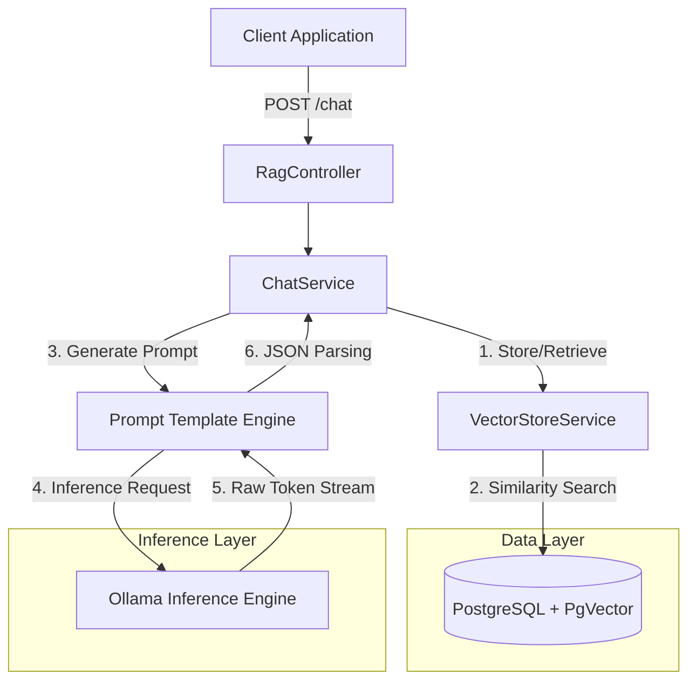

# RAG Shopping Assistant Module: Tài Liệu Kỹ Thuật

## 1. Giới Thiệu

Module RAG (Retrieval-Augmented Generation) Shopping Assistant là một hệ thống chuyên biệt được thiết kế để cung cấp các gợi ý sản phẩm theo ngữ cảnh và xác định (deterministic). Bằng cách tích hợp Mô hình Không gian Vector (Vector Space Modeling - VSM) với các Mô hình Ngôn ngữ Lớn (LLMs), hệ thống thu hẹp khoảng cách giữa các truy vấn ngôn ngữ tự nhiên phi cấu trúc và dữ liệu kho hàng có cấu trúc.

Tài liệu này đóng vai trò là tham chiếu kỹ thuật chính thống cho kiến trúc, triển khai và mở rộng của module RAG.

### 1.1 Các Khả Năng Chính

*   **Truy Xuất Thông Tin Ngữ Nghĩa (Semantic Information Retrieval):** Sử dụng vector embeddings (768 chiều) để xác định độ liên quan của sản phẩm vượt ra ngoài việc khớp từ khóa đơn thuần.
*   **Đầu Ra Có Cấu Trúc Xác Định (Deterministic Structured Output):** Bắt buộc tuân thủ schema JSON nghiêm ngặt cho các phản hồi, cho phép tích hợp frontend mạnh mẽ (Generative UI).
*   **Giảm Thiểu Ảo Giác (Hallucination Mitigation):** Thực hiện các ranh giới context nghiêm ngặt để đảm bảo các gợi ý được trích xuất độc quyền từ kho hàng hiện có.
*   **Kỹ Thuật Prompt (Prompt Engineering):** Tận dụng chain-of-thought prompting và context cấu trúc XML để định hướng suy luận của LLM.

---

## 2. Kiến Trúc Hệ Thống

Hệ thống tuân theo mẫu kiến trúc hướng vi dịch vụ (micro-service oriented), điều phối sự tương tác giữa lớp ứng dụng, cơ sở dữ liệu vector và công cụ suy luận (inference engine).

### 2.1 Quy Trình Luồng Thông Tin (Information Flow Pipeline)

Pipeline RAG thực thi chuỗi sau cho mỗi tương tác người dùng:

1.  **Phân Rã Truy Vấn (Query Decomposition):** Nhận đầu vào ngôn ngữ tự nhiên từ người dùng.
2.  **Vector Embedding:** Đầu vào được chuyển đổi thành biểu diễn vector sử dụng mô hình `nomic-embed-text`.
3.  **Truy Xuất Ngữ Nghĩa (Semantic Retrieval):** Thực hiện tìm kiếm Cosine Similarity đối với `vector_store` trong PostgreSQL để truy xuất top $K$ tài liệu sản phẩm liên quan.
4.  **Xây Dựng Context (Context Construction):** Các sản phẩm được truy xuất được định dạng thành khối context `INVENTORY` có cấu trúc.
5.  **Tổng Hợp Prompt (Prompt Synthesis):** Một system prompt động được xây dựng, kết hợp context `INVENTORY`, truy vấn người dùng và hướng dẫn schema đầu ra.
6.  **Suy Luận & Phân Tích (Inference & Parsing):** Mô hình `llama3.2` tạo phản hồi, sau đó được parse bởi `BeanOutputConverter` thành đối tượng `ShopAssistantResponse` định kiểu mạnh (strongly-typed).

### 2.2 Sơ Đồ Thành Phần (Component Diagram)



---

## 3. Đặc Tả Dữ Liệu (Data Specification)

### 3.1 Schema Phản Hồi (`ShopAssistantResponse`)

API đảm bảo phản hồi có cấu trúc tuân thủ schema sau. Việc định kiểu nghiêm ngặt này tạo điều kiện ánh xạ trực tiếp tới các thành phần UI.

| Trường | Kiểu | Mô Tả |
| :--- | :--- | :--- |
| `summary` | `String` | Bản tóm tắt ngôn ngữ tự nhiên súc tích về gợi ý (1-2 câu). |
| `detailedResponse` | `String` (Markdown) | Diễn giải toàn diện bao gồm gợi ý "Hero", các lựa chọn thay thế và mô tả cảm quan. |
| `products` | `List<ProductRecommendation>` | Danh sách có cấu trúc các sản phẩm riêng biệt được tham chiếu trong phản hồi. |
| `nextSteps` | `List<String>` | Ba hành động hoặc câu hỏi tiếp theo riêng biệt để hướng dẫn người dùng tương tác. |

### 3.2 Thực Thể Sản Phẩm (`ProductRecommendation`)

| Trường | Kiểu | Ràng Buộc | Mô Tả |
| :--- | :--- | :--- | :--- |
| `id` | `UUID` | **Immutable** | Định danh duy nhất của sản phẩm như được index trong cơ sở dữ liệu. |
| `name` | `String` | **Immutable** | Tên hiển thị chính xác của sản phẩm. |
| `price` | `BigDecimal` | `> 0` | Giá bán lẻ hiện tại. |
| `reasonForRecommendation` | `String` | | Biện chứng được tạo ra giải thích sự liên quan ngữ nghĩa với truy vấn. |

---

## 4. Chi Tiết Triển Khai (Implementation Details)

### 4.1 Cấu Hình Vector Store

Hệ thống sử dụng `pgvector` cho các hoạt động vector hiệu năng cao trong PostgreSQL.

*   **Metric:** Cosine Similarity
*   **Dimensions:** 768
*   **Index Type:** HNSW (Hierarchical Navigable Small World) cho tìm kiếm láng giềng gần nhất xấp xỉ hiệu quả.

### 4.2 Chiến Lược Kỹ Thuật Prompt (Prompt Engineering Strategy)

Các prompt được quản lý dưới dạng tài nguyên bên ngoài trong `src/main/resources/prompt/` để cho phép lặp lại (iteration) mà không cần biên dịch lại code.

*   **Cô Lập Context (Context Isolation):** Dữ liệu kho hàng được đóng gói trong các dấu phân cách rõ ràng (ví dụ: `INVENTORY:`) để ngăn rò rỉ dữ liệu.
*   **Tinh Chỉnh Hướng Dẫn (Instruction Tuning):** Logic "Chain of thought" được nhúng trong system prompt để hướng dẫn mô hình qua các bước lọc, lựa chọn và định dạng.
*   **Thực Thi Schema (Schema Enforcement):** `BeanOutputConverter` tiêm định nghĩa JSON schema trực tiếp vào prompt để ràng buộc định dạng đầu ra.

---

## 5. Triển Khai & Cấu Hình

### 5.1 Yêu Cầu Môi Trường

Việc triển khai dựa trên các định nghĩa biến sau (`.env`):

```bash
# Cấu hình Inference Engine
OLLAMA_BASE_URL=http://ollama:11434
OLLAMA_CHAT_MODEL=llama3.2
OLLAMA_EMBEDDING_MODEL=nomic-embed-text

# Các Siêu Tham Số RAG (Hyperparameters)
RAG_SEARCH_TOP_K=5              # Cardinality của tập truy xuất
RAG_SIMILARITY_THRESHOLD=0.3    # Điểm liên quan tối thiểu (0.0 - 1.0)
```

### 5.2 Thiết Lập Hạ Tầng

Việc điều phối được định nghĩa qua `docker-compose.yml`. Đảm bảo dịch vụ `ollama` ở trạng thái healthy trước khi khởi động ứng dụng.

```bash
# Khởi Tạo Mô Hình (Thiết lập một lần)
./scripts/setup-ollama.sh
```

---

## 6. Quy Trình Vận Hành

### 6.1 Chiến Lược Indexing

Indexing là một hoạt động quản trị không đồng bộ (asynchronous). Nó liên quan đến việc lặp qua danh mục sản phẩm, tạo embeddings và upsert vào vector store.

**Endpoint:** `POST /per/rag/index`
**Xác Thực:** Yêu cầu vai trò `ADMIN`.

### 6.2 Bảo Trì & Xử Lý Sự Cố

**Bất Thường Phổ Biến: Truy Vấn Không Có Kết Quả**
*   *Chẩn Đoán:* `RAG_SIMILARITY_THRESHOLD` cao hoặc vector store trống.
*   *Giải Pháp:* Xác minh trạng thái index qua `GET /per/rag/knowledge/status` và điều chỉnh ngưỡng trong `application.yml`.

**Bất Thường Phổ Biến: Đầu Ra JSON Sai Định Dạng**
*   *Chẩn Đoán:* LLM có thể bao đóng JSON thô trong các khối mã Markdown (` ```json `).
*   *Giải Pháp:* Middleware `cleanMarkdownCodeBlocks()` tự động làm sạch chuỗi đầu ra trước khi parse.

---

## 7. Hướng Dẫn Mở Rộng (Extensibility Guidelines)

Để mở rộng khả năng của module:

1.  **Nguồn Dữ Liệu Mới:** Triển khai các giao diện `DocumentReader` để nhập dữ liệu phi sản phẩm (ví dụ: bài viết blog, chính sách).
2.  **Mô Hình Tùy Chỉnh:** Triển khai giao diện `ChatModel` để hoán đổi Ollama cho OpenAI hoặc Azure tương đương.
3.  **Lặp Lại Prompt:** Sửa đổi `system-prompt.txt` để điều chỉnh giọng điệu, các hạn chế hoặc quy tắc định dạng. Thay đổi có hiệu lực trong yêu cầu tiếp theo (runtime loading).
