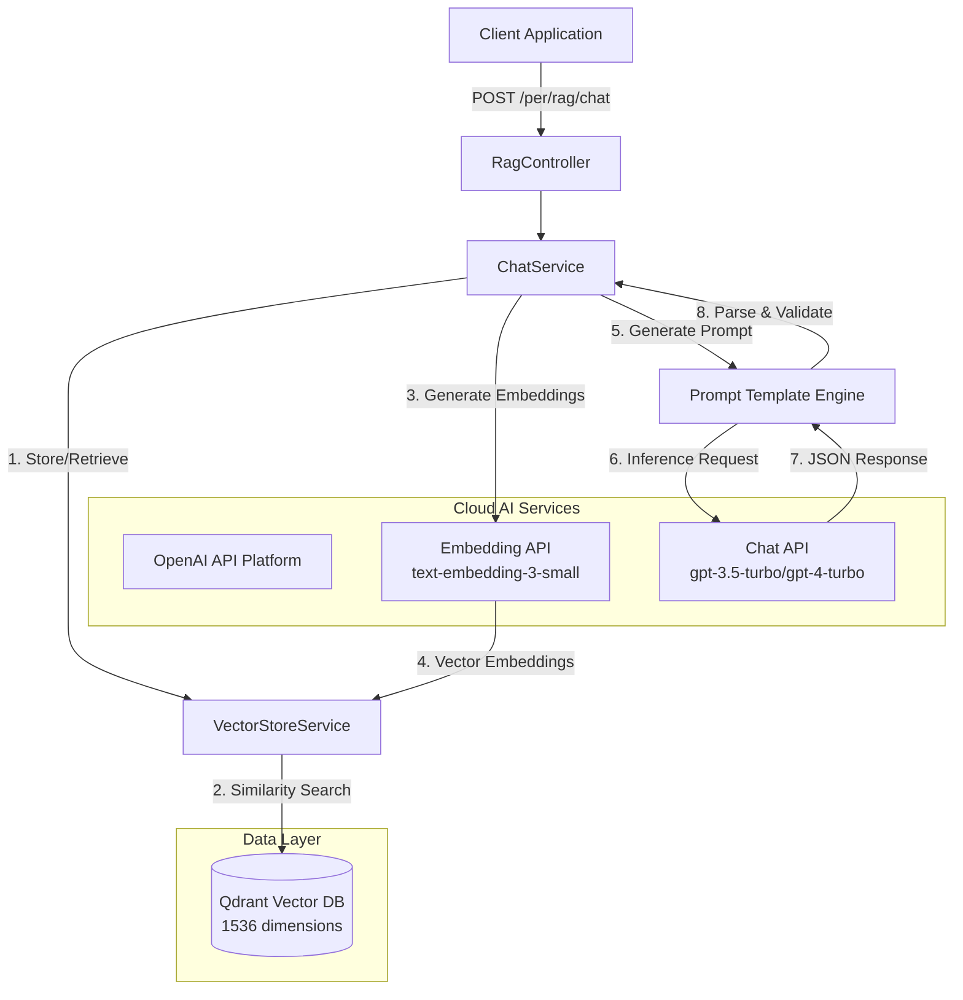

# RAG Shopping Assistant Module: Tài Liệu Kỹ Thuật

## 1. Giới Thiệu

Module RAG (Retrieval-Augmented Generation) Shopping Assistant là một hệ thống chuyên biệt được thiết kế để cung cấp các gợi ý sản phẩm theo ngữ cảnh và xác định (deterministic). Bằng cách tích hợp Mô hình Không gian Vector (Vector Space Modeling - VSM) với các Mô hình Ngôn ngữ Lớn (LLMs) thông qua nền tảng suy luận đám mây của OpenAI, hệ thống thu hẹp khoảng cách giữa các truy vấn ngôn ngữ tự nhiên phi cấu trúc và dữ liệu kho hàng có cấu trúc.

Tài liệu này đóng vai trò là tham chiếu kỹ thuật chính thống cho kiến trúc, triển khai và mở rộng của module RAG.

### 1.1 Các Khả Năng Chính

*   **Truy Xuất Thông Tin Ngữ Nghĩa (Semantic Information Retrieval):** Sử dụng vector embeddings (1536 chiều) được tạo bởi mô hình `text-embedding-3-small` của OpenAI để xác định độ liên quan của sản phẩm vượt ra ngoài việc khớp từ khóa đơn thuần.
*   **Đầu Ra Có Cấu Trúc Xác Định (Deterministic Structured Output):** Bắt buộc tuân thủ schema JSON nghiêm ngặt cho các phản hồi, cho phép tích hợp frontend mạnh mẽ (Generative UI).
*   **Giảm Thiểu Ảo Giác (Hallucination Mitigation):** Thực hiện các ranh giới context nghiêm ngặt để đảm bảo các gợi ý được trích xuất độc quyền từ kho hàng hiện có.
*   **Kỹ Thuật Prompt (Prompt Engineering):** Tận dụng chain-of-thought prompting và context cấu trúc XML để định hướng suy luận của LLM.
*   **Khởi Tạo Tự Động (Automated Initialization):** Tự động phát hiện vector store trống và kích hoạt indexing khi khởi động ứng dụng.

---

## 2. Kiến Trúc Hệ Thống

Hệ thống tuân theo mẫu kiến trúc cloud-native, điều phối sự tương tác giữa lớp ứng dụng, cơ sở dữ liệu vector (PostgreSQL với pgvector), và nền tảng suy luận của OpenAI.

### 2.1 Quy Trình Luồng Thông Tin (Information Flow Pipeline)

Pipeline RAG thực thi chuỗi sau cho mỗi tương tác người dùng:

1.  **Phân Rã Truy Vấn (Query Decomposition):** Nhận đầu vào ngôn ngữ tự nhiên từ người dùng qua REST API.
2.  **Vector Embedding:** Đầu vào được chuyển đổi thành biểu diễn vector 1536 chiều sử dụng mô hình embedding `text-embedding-3-small` của OpenAI.
3.  **Truy Xuất Ngữ Nghĩa (Semantic Retrieval):** Thực hiện tìm kiếm Cosine Similarity đối với bảng `vector_store` trong PostgreSQL để truy xuất top $K$ tài liệu sản phẩm liên quan.
4.  **Xây Dựng Context (Context Construction):** Các sản phẩm được truy xuất được định dạng thành khối context `INVENTORY` có cấu trúc kèm metadata.
5.  **Tổng Hợp Prompt (Prompt Synthesis):** Một system prompt động được xây dựng, kết hợp context `INVENTORY`, truy vấn người dùng và hướng dẫn schema đầu ra.
6.  **Suy Luận & Phân Tích (Inference & Parsing):** Mô hình chat của OpenAI (mặc định: `gpt-3.5-turbo`) tạo phản hồi, sau đó được parse bởi `BeanOutputConverter` thành đối tượng `ShopAssistantResponse` định kiểu mạnh (strongly-typed).

### 2.2 Sơ Đồ Thành Phần (Component Diagram)



---

## 3. Đặc Tả Dữ Liệu (Data Specification)

### 3.1 Schema Phản Hồi (`ShopAssistantResponse`)

API đảm bảo phản hồi có cấu trúc tuân thủ schema sau. Việc định kiểu nghiêm ngặt này tạo điều kiện ánh xạ trực tiếp tới các thành phần UI.

| Trường | Kiểu | Mô Tả |
| :--- | :--- | :--- |
| `summary` | `String` | Bản tóm tắt ngôn ngữ tự nhiên súc tích về gợi ý (1-2 câu). |
| `detailedResponse` | `String` (Markdown) | Diễn giải toàn diện bao gồm gợi ý "Hero", các lựa chọn thay thế và mô tả cảm quan. |
| `products` | `List<ProductRecommendation>` | Danh sách có cấu trúc các sản phẩm riêng biệt được tham chiếu trong phản hồi. |
| `nextSteps` | `List<String>` | Ba hành động hoặc câu hỏi tiếp theo riêng biệt để hướng dẫn người dùng tương tác. |

### 3.2 Thực Thể Sản Phẩm (`ProductRecommendation`)

| Trường | Kiểu | Ràng Buộc | Mô Tả |
| :--- | :--- | :--- | :--- |
| `id` | `UUID` | **Immutable** | Định danh duy nhất của sản phẩm như được index trong cơ sở dữ liệu. |
| `name` | `String` | **Immutable** | Tên hiển thị chính xác của sản phẩm. |
| `price` | `BigDecimal` | `> 0` | Giá bán lẻ hiện tại. |
| `reasonForRecommendation` | `String` | | Biện chứng được tạo ra giải thích sự liên quan ngữ nghĩa với truy vấn. |

---

## 4. Chi Tiết Triển Khai (Implementation Details)

### 4.1 Cấu Hình Vector Store

Hệ thống sử dụng Qdrant làm cơ sở dữ liệu vector với nhiều collections cho các loại thực thể khác nhau.

**Collections:**
| Collection | Loại Thực Thể | Mục Đích |
| :--- | :--- | :--- |
| `product_vectors` | Sản phẩm | Tìm kiếm ngữ nghĩa sản phẩm |
| `brand_vectors` | Thương hiệu | Khám phá thương hiệu |
| `category_vectors` | Danh mục | Điều hướng danh mục |

**Cấu hình:**
*   **Metric:** Cosine Similarity
*   **Dimensions:** 1536 (phù hợp với đầu ra của mô hình `text-embedding-3-small` của OpenAI)
*   **Index Type:** HNSW (Hierarchical Navigable Small World)
*   **API:** REST/gRPC qua Spring AI Qdrant Store Starter

### 4.2 Chiến Lược Kỹ Thuật Prompt (Prompt Engineering Strategy)

Các prompt được quản lý dưới dạng tài nguyên bên ngoài trong `src/main/resources/prompt/` để cho phép lặp lại (iteration) mà không cần biên dịch lại code.

*   **Cô Lập Context (Context Isolation):** Dữ liệu kho hàng được đóng gói trong các dấu phân cách rõ ràng (ví dụ: `INVENTORY:`) để ngăn rò rỉ dữ liệu.
*   **Tinh Chỉnh Hướng Dẫn (Instruction Tuning):** Logic "Chain of thought" được nhúng trong system prompt để hướng dẫn mô hình qua các bước lọc, lựa chọn và định dạng.
*   **Thực Thi Schema (Schema Enforcement):** `BeanOutputConverter` tiêm định nghĩa JSON schema trực tiếp vào prompt để ràng buộc định dạng đầu ra.

### 4.3 Khởi Tạo Tự Động (Automated Initialization)

Component `RagDataInitializer` (triển khai `CommandLineRunner`) tự động xác minh trạng thái vector store khi khởi động ứng dụng:

*   **Xác Minh:** Thực hiện truy vấn nhẹ để kiểm tra số lượng tài liệu
*   **Indexing Có Điều Kiện:** Nếu vector store trống (`totalDocuments == 0`), tự động kích hoạt:
    *   Indexing danh mục sản phẩm
    *   Indexing tài liệu knowledge base
*   **Thực Thi Bất Đồng Bộ:** Chạy trong thread nền để tránh chặn quá trình khởi động ứng dụng
*   **Cấu Hình:** Điều khiển qua thuộc tính `app.rag.auto-index` (mặc định: `true`)

---

## 5. Triển Khai & Cấu Hình

### 5.1 Yêu Cầu Môi Trường

Việc triển khai dựa trên các định nghĩa biến sau (`.env`):

```bash
# Cấu hình OpenAI API
OPENAI_API_KEY=sk-proj-...                    # Bắt buộc: API key của OpenAI
OPENAI_CHAT_MODEL=gpt-3.5-turbo               # Tùy chọn: Mô hình chat mặc định
OPENAI_EMBEDDING_MODEL=text-embedding-3-small # Tùy chọn: Mô hình embedding mặc định

# Các Siêu Tham Số RAG (Hyperparameters)
RAG_SEARCH_TOP_K=5              # Cardinality của tập truy xuất
RAG_SIMILARITY_THRESHOLD=0.3    # Điểm liên quan tối thiểu (0.0 - 1.0)

# Điều Khiển Auto-Indexing
APP_RAG_AUTO_INDEX=true         # Bật indexing tự động khi khởi động
```

### 5.2 Thiết Lập Hạ Tầng

Việc điều phối được định nghĩa qua `docker-compose.yml`. Không cần công cụ suy luận local—tất cả các thao tác AI được xử lý bởi nền tảng đám mây của OpenAI.

**Yêu Cầu:**
1. API key OpenAI hợp lệ với quyền truy cập:
   * Mô hình chat (ví dụ: `gpt-3.5-turbo`, `gpt-4-turbo`)
   * Mô hình embedding (`text-embedding-3-small`)
2. Qdrant instance (self-hosted qua Docker hoặc cloud)
3. Kết nối mạng tới `api.openai.com`

**Hạ Tầng:**
Qdrant được triển khai qua `docker-compose.yml` với lưu trữ bền vững trong `./qdrant_storage`.

### 5.3 Cấu Hình Ứng Dụng

**`application.yml`** (hoặc các biến thể theo profile):

```yaml
spring:
  ai:
    openai:
      api-key: ${OPENAI_API_KEY}
      chat:
        model: ${OPENAI_CHAT_MODEL:gpt-3.5-turbo}
      embedding:
        model: ${OPENAI_EMBEDDING_MODEL:text-embedding-3-small}
    vectorstore:
      qdrant:
        host: ${QDRANT_HOST:qdrant}
        port: ${QDRANT_PORT:6334}
        collection-name: ${QDRANT_COLLECTION:product_vectors}
        use-tls: false

app:
  rag:
    auto-index: ${APP_RAG_AUTO_INDEX:true}
    chat-model: ${OPENAI_CHAT_MODEL:gpt-3.5-turbo}
    search-top-k: ${RAG_SEARCH_TOP_K:3}
    similarity-threshold: ${RAG_SIMILARITY_THRESHOLD:0.3}
    qdrant:
      collections:
        product: ${QDRANT_COLLECTION_PRODUCT:product_vectors}
        brand: ${QDRANT_COLLECTION_BRAND:brand_vectors}
        category: ${QDRANT_COLLECTION_CATEGORY:category_vectors}
```

---

## 6. Quy Trình Vận Hành

### 6.1 Chiến Lược Indexing

**Indexing Tự Động (Được Khuyến Nghị):**
Indexing xảy ra tự động khi khởi động ứng dụng nếu vector store trống. Component `RagDataInitializer` xử lý quá trình này bất đồng bộ.

**Indexing Thủ Công:**
Để re-indexing hoặc cập nhật quản trị:

**Endpoint:** `POST /per/rag/index`
**Xác Thực:** Yêu cầu vai trò `ADMIN`.
**Mô Tả:** Kích hoạt re-indexing toàn bộ danh mục sản phẩm.

**Indexing Knowledge Base:**
**Endpoint:** `POST /per/rag/knowledge/index`
**Xác Thực:** Yêu cầu vai trò `ADMIN`.
**Mô Tả:** Indexing tất cả các file markdown từ thư mục knowledge base.

### 6.2 Giám Sát Trạng Thái

**Endpoint:** `GET /per/rag/knowledge/status`
**Xác Thực:** Công khai (không yêu cầu xác thực)
**Phản Hồi:**
```json
{
  "totalDocuments": 150,
  "productDocuments": 120,
  "knowledgeDocuments": 30,
  "knowledgeSources": ["policies.md", "faq.md"],
  "isIndexed": true
}
```

### 6.3 Bảo Trì & Xử Lý Sự Cố

**Bất Thường Phổ Biến: Truy Vấn Không Có Kết Quả**
*   *Chẩn Đoán:* `RAG_SIMILARITY_THRESHOLD` cao hoặc vector store trống.
*   *Giải Pháp:*
    1. Xác minh trạng thái index qua `GET /per/rag/knowledge/status`
    2. Điều chỉnh ngưỡng trong `application.yml` (giảm `RAG_SIMILARITY_THRESHOLD`)
    3. Nếu store trống, kích hoạt indexing thủ công hoặc khởi động lại ứng dụng (auto-index sẽ chạy)

**Bất Thường Phổ Biến: Đầu Ra JSON Sai Định Dạng**
*   *Chẩn Đoán:* LLM có thể bao đóng JSON thô trong các khối mã Markdown (` ```json `).
*   *Giải Pháp:* Middleware `cleanMarkdownCodeBlocks()` tự động làm sạch chuỗi đầu ra trước khi parse.

**Bất Thường Phổ Biến: Lỗi OpenAI API**
*   *Chẩn Đoán:* API key không hợp lệ, giới hạn tốc độ, hoặc mô hình không khả dụng.
*   *Giải Pháp:*
    1. Xác minh `OPENAI_API_KEY` được thiết lập đúng
    2. Kiểm tra API key có quyền truy cập các mô hình được chỉ định
    3. Xem xét trạng thái và giới hạn tốc độ của OpenAI API
    4. Cân nhắc nâng cấp lên tier mô hình với giới hạn tốc độ cao hơn

**Bất Thường Phổ Biến: Không Khớp Kích Thước Vector**
*   *Chẩn Đoán:* Schema cơ sở dữ liệu sử dụng kích thước vector sai (ví dụ: 768 thay vì 1536).
*   *Giải Pháp:* Đảm bảo Flyway migration `V18__Enable_pgvector_extension.sql` đã được áp dụng với 1536 chiều.

---

## 7. Hướng Dẫn Mở Rộng (Extensibility Guidelines)

Để mở rộng khả năng của module:

1.  **Nguồn Dữ Liệu Mới:** Triển khai các giao diện `DocumentReader` để nhập dữ liệu phi sản phẩm (ví dụ: bài viết blog, chính sách, FAQ).
2.  **Mô Hình Tùy Chỉnh:** Hệ thống sử dụng giao diện `ChatModel` của Spring AI, hỗ trợ nhiều nhà cung cấp. Để chuyển đổi nhà cung cấp, cập nhật cấu hình `application.yml` (ví dụ: Azure OpenAI, Anthropic Claude).
3.  **Lặp Lại Prompt:** Sửa đổi `system-prompt.txt` trong `src/main/resources/prompt/` để điều chỉnh giọng điệu, các hạn chế hoặc quy tắc định dạng. Thay đổi có hiệu lực trong yêu cầu tiếp theo (runtime loading).
4.  **Mô Hình Embedding:** Để sử dụng các mô hình embedding khác (ví dụ: `text-embedding-3-large` cho 3072 chiều), cập nhật cấu hình và schema cơ sở dữ liệu tương ứng.

---

## 8. Cân Nhắc Hiệu Năng

*   **Tạo Embedding:** Các lời gọi OpenAI API là bất đồng bộ và được cache khi có thể. Cân nhắc triển khai local caching cho các embedding được truy vấn thường xuyên.
*   **Tìm Kiếm Vector:** Chỉ mục HNSW cung cấp thời gian tìm kiếm dưới mili giây cho datasets lên đến hàng triệu vector.
*   **Giới Hạn Tốc Độ:** Triển khai circuit breakers và logic retry (qua Resilience4j) để xử lý giới hạn tốc độ OpenAI API một cách duyên dáng.
*   **Tối Ưu Chi Phí:**
    *   Sử dụng `text-embedding-3-small` cho embeddings (chi phí thấp, 1536 chiều)
    *   Cân nhắc `gpt-3.5-turbo` cho chat (tiết kiệm chi phí) vs `gpt-4-turbo` (chất lượng cao hơn)
    *   Triển khai response caching cho các truy vấn giống hệt nhau

---

## 9. Bảo Mật & Tuân Thủ

*   **Quản Lý API Key:** Lưu trữ `OPENAI_API_KEY` trong biến môi trường hoặc hệ thống quản lý bí mật an toàn. Không bao giờ commit API keys vào version control.
*   **Quyền Riêng Tư Dữ Liệu:** Dữ liệu sản phẩm gửi tới OpenAI phải tuân theo chính sách sử dụng dữ liệu của OpenAI. Xem xét và tuân thủ các yêu cầu quyền riêng tư dữ liệu của tổ chức.
*   **Xác Thực Đầu Vào:** Tất cả truy vấn người dùng được xác thực và làm sạch trước khi xử lý để ngăn chặn các cuộc tấn công injection.
*   **Kiểm Soát Truy Cập:** Các endpoint quản trị (indexing, xóa) yêu cầu xác thực vai trò `ADMIN`.

---

## Phụ Lục A: Đặc Tả Mô Hình

| Mô Hình | Nhà Cung Cấp | Chiều | Trường Hợp Sử Dụng | Tier Chi Phí |
| :--- | :--- | :--- | :--- | :--- |
| `text-embedding-3-small` | OpenAI | 1536 | Vector embeddings | Thấp |
| `text-embedding-3-large` | OpenAI | 3072 | Embeddings độ chính xác cao | Trung bình |
| `gpt-3.5-turbo` | OpenAI | N/A | Chat completion (mặc định) | Thấp |
| `gpt-4-turbo` | OpenAI | N/A | Chat completion (premium) | Cao |

---

## Phụ Lục B: Ghi Chú Migration

**Từ Ollama Sang OpenAI:**
Module này đã được migration từ hạ tầng dựa trên Ollama local sang nền tảng đám mây của OpenAI. Các thay đổi chính:

*   **Kích Thước Vector:** 768 → 1536 (yêu cầu database migration)
*   **Tên Mô Hình:** `llama3.2` → `gpt-3.5-turbo`, `nomic-embed-text` → `text-embedding-3-small`
*   **Hạ Tầng:** Loại bỏ dependency dịch vụ Docker `ollama` local
*   **Khởi Tạo:** Thay thế `OllamaInitializer` bằng `RagDataInitializer` cho indexing khởi động tự động

Để biết chi tiết migration, tham khảo README chính của dự án và các script migration.
