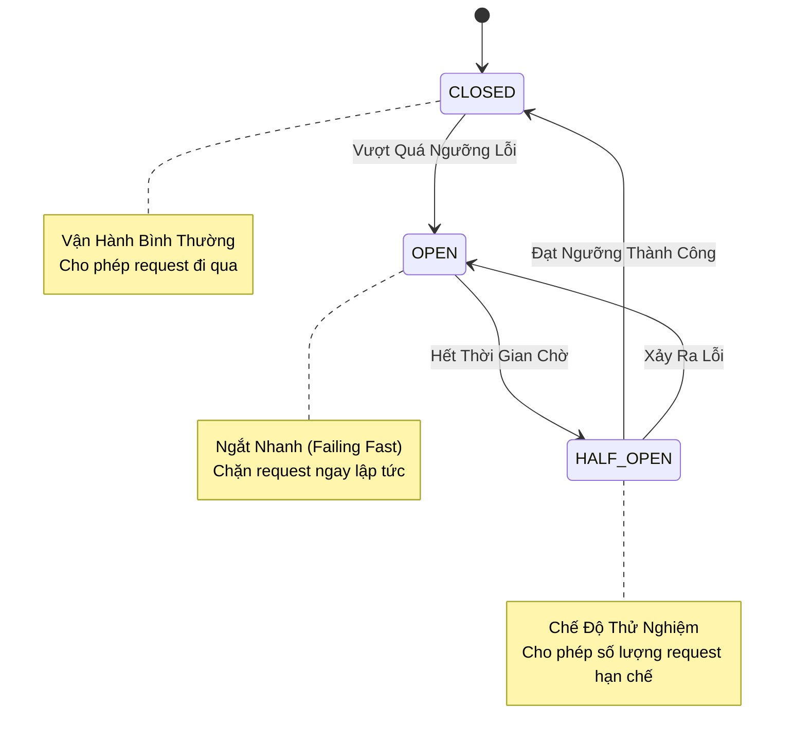

# Mẫu Resilience: Circuit Breaker (Ngắt Mạch)

## 1. Giới Thiệu

Mẫu **Circuit Breaker** cho phép ứng dụng thất bại nhanh (fail fast) và phục hồi linh hoạt khi các dịch vụ phụ thuộc hoặc hoạt động gặp tỷ lệ lỗi cao hoặc độ trễ lớn. Điều này ngăn chặn các lỗi dây chuyền (cascading failures) và kiệt quệ tài nguyên trong các hệ thống phân tán.

---

## 2. Trạng Thái Vận Hành

Circuit breaker hoạt động như một máy trạng thái hữu hạn (finite state machine - FSM) với ba trạng thái chính.



### 2.1 Định Nghĩa Trạng Thái

*   **CLOSED**: Hệ thống khỏe mạnh. Các request được thực thi bình thường. Metrics được thu thập để giám sát tỷ lệ lỗi.
*   **OPEN**: Ngưỡng lỗi đã bị vi phạm. Các request thất bại ngay lập tức với `CallNotPermittedException` mà không thực thi logic bên dưới.
*   **HALF_OPEN**: Sau một khoảng thời gian chờ cấu hình, mạch cho phép một số lượng hạn chế các request "thăm dò" (probe) để kiểm tra xem vấn đề cơ bản đã được giải quyết chưa.

---

## 3. Đặc Tả Cấu Hình

Việc triển khai sử dụng **Resilience4j**. Cấu hình được định nghĩa trong `resilience4j.yml`.

### 3.1 Tham Số Ngưỡng

| Tham số | Giá trị | Mô tả |
| :--- | :--- | :--- |
| `slidingWindowSize` | 10 | Số lượng cuộc gọi để đo lường tỷ lệ lỗi. |
| `failureRateThreshold` | 50% | Tỷ lệ phần trăm lỗi để kích hoạt trạng thái OPEN. |
| `waitDurationInOpenState` | 5s | Thời gian giữ ở OPEN trước khi chuyển sang HALF_OPEN. |
| `permittedNumberOfCallsInHalfOpenState` | 3 | Số lượng request thăm dò được phép. |

### 3.2 Xử Lý Ngoại Lệ

Chỉ các ngoại lệ quan trọng cụ thể mới kích hoạt bộ đếm lỗi. Các ngoại lệ nghiệp vụ (ví dụ: Lỗi Validate) bị bỏ qua.

*   **Ngoại Lệ Được Ghi Nhận**: `ResourceAccessException`, `TimeoutException`, `ConnectException`
*   **Ngoại Lệ Bỏ Qua**: `IllegalArgumentException`, `MethodArgumentNotValidException`

---

## 4. Triển Khai

### 4.1 Sử Dụng Annotation

Annotation `@CircuitBreaker` trang trí các phương thức service hoặc controller.

```java
@CircuitBreaker(name = "backendA", fallbackMethod = "fallback")
public String doSomething() {
    return restTemplate.getForObject("/slow-service", String.class);
}

// Chữ ký Fallback phải khớp với phương thức gốc + ngoại lệ
public String fallback(CallNotPermittedException ex) {
    return "Dịch vụ hiện không khả dụng. Vui lòng thử lại sau.";
}
```

### 4.2 Tích Hợp Actuator

Giám sát được expose qua các endpoint Spring Boot Actuator:

*   **Health Check**: `/actuator/health` (Báo cáo UP/CIRCUIT_OPEN)
*   **Metrics**: `/actuator/metrics/resilience4j.circuitbreaker.calls`

---

## 5. Kịch Bản Sử Dụng

| Tình Huống | Hành Vi | Trải Nghiệm Người Dùng |
| :--- | :--- | :--- |
| **Database Down** | Circuit Opens | Thông báo lỗi nhanh ("Bảo trì hệ thống") thay vì treo. |
| **External API Timeout** | Circuit Opens | Trả về dữ liệu cache hoặc áp dụng fallback mặc định. |
| **Phục Hồi** | Chuyển sang Half-Open | Hệ thống tự động tự chữa lành mà không cần khởi động lại thủ công. |
