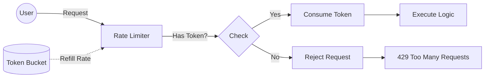

# Resilience Pattern: Rate Limiter

## 1. Introduction

The **Rate Limiter** pattern controls the throughput of traffic sent to or received by a network interface or service. It protects the application from overwhelming traffic spikes, accidental DoS attacks, and ensures fair resource allocation among consumers.

---

## 2. Architecture

The implementation uses the **Token Bucket** (or Leaky Bucket) algorithm provided by Resilience4j.



### 2.1 Algorithm Mechanics

*   **Limit**: Maximum number of permits (requests) allowed per period.
*   **Period**: Time window for the refresh cycle.
*   **Timeout**: Duration a thread waits for a permit before giving up.

---

## 3. Configuration Specification

Configuration is managed in `resilience4j.yml`. We distinguish between development and production profiles.

### 3.1 Policy Definitions

| Instance Name | Limit | Period | Timeout | use Case |
| :--- | :--- | :--- | :--- | :--- |
| `general` | 100 | 1s | 0ms | Standard API protection. |
| `sensitive` | 5 | 1m | 0ms | High-risk endpoints (e.g., OTP generation). |
| `media` | 10 | 1s | 0ms | File upload endpoints. |

### 3.2 Response Contract

When a request is rejected, the system throws `RequestNotPermitted`. This is mapped to a standard HTTP response by the Global Exception Handler.

*   **HTTP Status**: `429 Too Many Requests`
*   **Body**: Standard `ApiResponse` with error code `RATE_LIMIT_EXCEEDED`.

---

## 4. Implementation Reference

### 4.1 Decorating Endpoints

```java
@RestController
public class MediaController {

    @PostMapping("/upload")
    @RateLimiter(name = "media", fallbackMethod = "handleRateLimit")
    public ApiResponse<String> upload(@RequestParam MultipartFile file) {
        return mediaService.upload(file);
    }

    public ApiResponse<String> handleRateLimit(RequestNotPermitted ex) {
        throw new ApiException(ApiErrorCode.RATE_LIMIT_EXCEEDED);
    }
}
```

### 4.2 Handling Fallbacks

It is best practice to throw a domain-specific exception in the fallback rather than returning a default value, allowing the global handler to standardize the 429 response structure.

---

## 5. Monitoring & Observability

Rate limiting metrics are crucial for capacity planning.

*   **Endpoint**: `/actuator/metrics/resilience4j.ratelimiter.waiting_threads`
*   **Endpoint**: `/actuator/metrics/resilience4j.ratelimiter.available_permissions`

**Alerting Rule Idea:**
Trigger alert if `available_permissions` drops to 0 for $> 10\%$ of requests in a 1-minute window.
